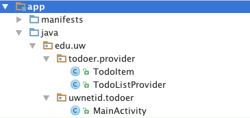

# Todoer
A common use of mobile applications (and really, computer programs in general) is to track and manage some specific kind of data. Such apps are often structured as [CRUD](https://en.wikipedia.org/wiki/Create,_read,_update_and_delete) systems that let you create, read, update, and delete data items. The classic, almost "hello-world"-esque example of a CRUD application is the "task list": a program that lets the user record tasks that need to be completed, and then mark when those tasks have been finished.

For this assignment, you will implementing a simple Android "To Do List" app with which the user can create and view tasks they need to complete. In particular, you will be utilizing components (i.e., fragments, menus, dialogs) that allow the user to effectively interact with and **navigate** different views of their stored data.


### Objectives
By completing this challenge you will practice and master the following skills:

* Using fragments to implement a multi-pane Activity
* Dynamically changing displayed fragments
* Including options menus for navigation
* Managing a history of screens and tasks in an app
* Creating and displaying pop-up dialogs and pickers
* Loading and modifying structured data from a database Content Provider
* Working with event callbacks


## User Stories
The user stories for the Self-Tracker app are:

* As a user, I want to record a task that I need to do and when that task needs to be done by.
* As a user, I want to view a list of tasks to complete so I know what I have to do.
* As a user, I want to be able to organize my tasks so I can better plan my life.
* As a user, I want to be able to cross of a task once it is completed.
* As a user, I want to see what tasks I have already completed so I can feel a sense of accomplishment.


#### Including The Content Provider
The starter code includes classes that will let you easily work with an underlying database of information in the form of a [`ContentProvider`](http://developer.android.com/guide/topics/providers/content-providers.html). A Content Provider is basically a "data source" that has a Uri (Universal Resource Indicator: think URL but not necessarily on the Internet) that you can query, similar in concept to how you get data from a website by sending a query. In particular, these Uri's specify the `content://` protocol, allowing you to access the data as content (rather than, say, HTTP). In effect, the `ContentProvider` acts as a "wrapper" for working with a `SQLite` database provided by the phone, which can then be used to store tasks.

- We will talk more about databases and content providers and how this class works later in the course.

In order to include the provided Content Provider in your program, you will need to move the starter code from this repo's `lib/` folder into your Android project folder--specifically, pasting the _entire_ provided `todoer` folder into your project's `src/main/java/edu/uw/` folder. In the end, the `TodoListProvider.java` and `TodoItem.java` files should be inside the `edu/uw/todoer/provider` package:



This exact setup is important because the package location of the `ContentProvider` is by necessity hard-coded into a few different places.

Finally, to include the Content Provider in your application, you will need to list it in the `Manifest` inside the `<application>` element:

```xml
<!-- This goes INSIDE the <application> element -->
<provider android:name="edu.uw.todoer.provider.TodoListProvider" android:authorities="edu.uw.todoer.provider"/>
```

Details about accessing the Content Provider are described [below](#accessing-data).


### Appearance and Interaction
Your application will be made up of three (4) different "views". (You can almost think of these as screens, but you'll be using [Fragments](http://developer.android.com/guide/components/fragments.html) to mix and match them on a single screen):

1. A **"master"** list of tasks that have been created _and still need to be completed_. This should be a scrollable list (e.g., using a `ListView` or a `GridView`). The list items themselves should include both the title of the task _and_ the date when that task needs to be completed by (the "deadline").

    - This list should be able to be **sorted** in two different ways: either by when the tasks were _created_ (in ascending order, with the oldest at the top) or by when they are _due_ (in ascending order, with the earliest deadline at the top). You should be able to change the sort order by selecting an item from an **options menu** available whenever this view is shown.

    - This view should also have a text title so the user knows what they are looking at!

2. A **"completed"** view that lists the tasks that have been completed. Completed tasks should be sorted by creation date (and do not need an alternative sorting method).

    - This view is basically the same as the "master" view, just showing different data! To that end, both views should be different _instances_ of the same `Fragment` class. You can pass information to the Fragment about which set of data it should show using `setArguments()` and a `Bundle`.

3. A **"detail"** view for a particular task. Each task will include the following elements:
    - A ___title___, or a short label for the task (e.g., "Call Mom").
    - A ___detail description___ of that task, giving more information or notes about what is involved (e.g., "Mom's number is: 555-1234"). This can also be left blank.
    - A ___deadline___ for when the task should be completed by (deadlines are great for getting stuff done!)
    - Whether or not the task has been ___completed___.

    This view will also need a way for the user to mark a task as completed or not (e.g., a toggling input control).

    You can lay these items out however you want, so long as the content is readable. I suggest making the **deadline** stand out (e.g., a large font). The goal is to make the _user experience_ as pleasant as possible: think about the user stories and how someone would use the app, and try to accommodate them! Use effective organization, labeling, etc.

4. A view to **"add"** a new task. This view should provide a way for the user to enter a title and detail description, as well as the deadline for the task. And of course, a way to "save" the task.

    - You should let the user pick a **day** and a **time** (separately) for the deadline using [pop-up dialogs](http://developer.android.com/guide/topics/ui/controls/pickers.html). I recommend having these dialogs set a value (possibly an instance variable) that can be displayed in a `TextView` as well so the user can see.

    After the user adds a task, you should use a [Toast](http://developer.android.com/guide/topics/ui/notifiers/toasts.html) to let them know that the item has been saved!


#### Muli-Pane Layout
This application will be designed (optimized?) for screens in a **landscape** orientation, as well as for larger devices such as tablets. However, we will be using [Fragments](http://developer.android.com/training/basics/fragments/index.html) to make it easy to eventually support **portrait**-oriented devices as well (and you can add this functionality as an extra-credit extension).

- **Pro tip**: The latest version of the Android build tools provides a nice rotate button [], so I recommend you update to those! Otherwise, you can switch the emulator into _landscape mode_ by hitting `ctrl-F11`.

In __landscape__ orientation, your app will use a "two-pane" layout: that is, it will show two Fragments (views) side by side. I'll refer to these as the "left pane" and the "right pane". These panes should support the following interaction:

- When the app starts, the app should show the "master list" view in the _left pane_, and the "add" view in the _right pane_ (the user can see their current to-do list and quickly add a new item).

- When the user clicks on any of the items in the "master list" view, the list should move to the _left pane_ (if it is not there already) and the _right pane_ should show the "details" view for the selected task.

    - Use [FragmentTransactions](http://developer.android.com/guide/components/fragments.html#Transactions) to change what fragments are displayed.

    - The user should be able to use the [_up navigation_](http://developer.android.com/training/implementing-navigation/temporal.html#back-fragments) (either clicking the "back" button or using a back icon in the [ActionBar](http://developer.android.com/guide/topics/ui/actionbar.html)) to return to the previous fragment layout (e.g., "master and add" from when the app starts).

- From any screen, the user should be able to select an item from the [options menu](http://developer.android.com/guide/topics/ui/menus.html#options-menu) (e.g., "Add Task") to view the "add" view in the _right pane_ (the _left pane_ should remain the same).

    - After adding the event, the user should be <a href="http://developer.android.com/reference/android/app/FragmentManager.html#popBackStack()">taken back</a> to their previous layout (<a href="http://developer.android.com/reference/android/app/FragmentManager.html#getBackStackEntryCount()">unless</a> they are at the starting layout).
    
    - Note about "popping" items off the back stack: you can use this as a way of "navigating" between elements--rather than committing a new transaction to change the layout, you can "reverse" a previous transaction to change the layout.

- From any screen, the user should be able to select an item from the options menu (e.g., "Show Completed"). This should show the "completed" view in the ___right pane___ (the "master" view should remain in the _left pane_).

- When the user clicks on any of the items in the "completed" view, that list should move to the _left pane_ (if it is not there already) and the _right pane_ should show the "details" for the selected task.

- From any screen, the user should be able to select an item from the options menu (e.g., "Show To Do"). This should show the "master" view list in the _left pane_ and **nothing** (e.g., blank) in the _right pane_.


Overall, the navigation should be _intuitive_ and fluid. The user should be able to complete all the user stories easily, without getting lost in the application!


#### A note about interface design
This is a course in mobile _development_, not _mobile design_. Our concern is primarily with implementation issues. That said, here in the iSchool we care more about the human than we do the machine. Thus we do care about the **user experience** of systems we create, even if that is not our primary focus.

So for this assignment, we're not grading you based on your app's interface in terms of its _visual design_ (e.g., use of colors, fonts, spacing, etc). But we will be grading the interface based on its _navigation design_: that is, how comfortable it is to move back and forth between different tasks and presentations of interaction.

The user experience is important! Think about how user will approach your app, and whether they will be able to use it to achieve their goals (as outlines in the user stories above).


### Accessing Data
In order to make this app actually useful as a to-do list, it will need some way to **persist** the data (so that tasks are saved between sessions). Android includes a number of ways to [store data](http://developer.android.com/guide/topics/data/data-storage.html), including the ability to create an [SQLite database](http://developer.android.com/guide/topics/data/data-storage.html#db). [SQLite](https://en.wikipedia.org/wiki/SQLite) is an incredibly simple [relational database](https://en.wikipedia.org/wiki/Relational_database_management_system), which is small and lightweight enough to work on mobile devices.

There are a lot of steps to create and work with an SQLite Database in Android. And since our focus right now is on user interfaces, I have provided you with a [`ContentProvider`](http://developer.android.com/guide/topics/providers/content-providers.html) class `TodoListProvider` that abstracts the database access and makes it much easier and more effective to work with.

- You are welcome to look at the `TodoListProvider` code; we will go over how it works with the database later in the course.

- Since this `ContentProvider` is wrapping around a database, it's possible (but **not** required) to inspect that data directly for debugging purposes. See [this link](http://developer.android.com/tools/help/sqlite3.html) for instruction. This requires some familiarity with relational databases, such as if you've taken INFO 340.

You can access the data in a particular `ContentProvider` by first fetching the <a href="http://developer.android.com/reference/android/content/Context.html#getContentResolver()">`ContentResolver`</a> for the current `Context` (e.g., `Activity`, which you may have to access via `getActivity()` from a Fragment), and then using that resolver's methods to access the specific provider, referenced by its URI (the URI for the `TodoListProvider` is stored in the `TodoListProvider.CONTENT_URI` constant)

- For example:

    ```java
    getContentResolver().insert(uri, values);
    ```
    Will "insert" the given values into the database found at the given URI. There are similar `.query()`, `.update()`, and `.delete()` methods.

- Note that these database access methods run on the **UI Thread**. Ideally, we'd use something like an [https://developer.android.com/reference/android/content/AsyncQueryHandler.html](AsyncQueryHandler) (similar to `AsyncTask`) to do all this work on a background thread. But since we're doing very simple interactions for practice, for this assignment it's okay if your `.insert()` and `.update()` calls happen on the UI Thread.

#### Cursors and Loading

The most common interaction we'll have with the database though is __querying__ it for a list of tasks to show. Querying a database will return a [`Cursor`](http://developer.android.com/reference/android/database/Cursor.html). This is a lot like an Iterator in Java; it keeps track of where you are in a list (e.g., what `i` would be on in a loop), and then provides methods that let us fetch values from the object at that spot in the list. You can then call methods to move around the list (e.g., to move to the next item). For example:

```java
cursor.moveToFront(); //move to the first item
String field0 = cursor.getString(0); //get the first field (column you specified) as a String
String name = cursor.getString(cursor.getColumnIndexOrThrow("name")); //get the "name" field as a String
cursor.moveToNext(); //go to the next item
```

- The nice thing about `Cursors` though is that they can easily be fed into `AdapterViews` by using a [`CursorAdapter`](http://developer.android.com/reference/android/widget/CursorAdapter.html) (as opposed to the `ArrayAdapter` we've used previously). The [**`SimpleCursorAdapter`**](http://developer.android.com/reference/android/widget/SimpleCursorAdapter.html) is a concrete implementation that is almost as easy to use as an `ArrayAdapter`.

In order to get the `Cursor` to pass into the adapter, we need to `.query()` the database. But we'll be doing this a lot (and so would like to do it off the UI Thread). And every time we do that query, we also want to update the `Adapter` so that the changes to the list show up!

In order to easily update your list with new data loaded on a background thread, you should use a [`Loader`](http://developer.android.com/guide/components/loaders.html). This is basically a wrapper around `ASyncTask`, but one that let's you quickly specify what action should occur in the background thread. In particular, Android provides a [`CursorLoader`](http://developer.android.com/reference/android/content/CursorLoader.html) specifically used to load Cursors, which can then be "swapped" into the adapter.

- To use a `CursorLoader`, you need to specify that your _Fragment_ implements the [`LoaderManager.LoaderCallback<Cursor>`](http://developer.android.com/reference/android/support/v4/app/LoaderManager.LoaderCallbacks.html) interface---basically saying that this fragment can react to Loader events.

    - You can then specify what the Loader should _do_ in the `onCreateLoader()` callback. Here you would instantiate and return a `CursorLoader` that queries the `ContentProvider` (e.g., `TodoListProvider`). Note that the third parameter is a "projection", which is just a list of columns you want to get from the data store; you can use the constants from provided `TodoItem` convenience class. **Be sure and include the `ID` field!** The rest of the parameters are the text you'd put in an SQL `SELECT` statement.

    - Finally, in the `onLoadFinished()` callback, you can `swap()` the `Cursor` into your `SimpleCursorAdapter` in order to feed that model data into your controller (for display in the view). See the [guide](http://developer.android.com/guide/components/loaders.html) for more details.

        - In the `onLoaderReset()` callback just swap in `null` for our Cursor, since there now is no content (it is "reset").

- In order to actually _start_ your background activity, use the `getLoaderManager().initLoader(...)` method. This is similar in flavor to the `AsyncTask.execute()` method we've used before. Note that you can use the `.restartLoader()` method to "recreate" the `CursorLoader`, like if you want to change the arguments passed to it (e.g., you want to **sort tasks differently**).

    - The first parameter to the `initLoader()` method is an id number for _which cursor you want to load_, and is passed in as the first param to `onCreateLoader()` (or is accessible via `Loader#getId()`). You can then use an `if` statement to determine which cursor you want to load: for example, if you want to load one that is sorted in a different way!

    - Alternatively (and more easily): if you have your "Sort" menu buttons specify an instance variable, you can use that to determine the parameters to the `CursorAdapter` you instantiate, thereby loading in a new set of data.


#### ViewBinding
The other thing to note about the `SimpleCursorAdapter` is that---like `ArrayAdapter`, it "simply" takes the text content from the database and feeds it directly into a `TextView`. However, sometimes you'll want to dynamically modify the data that is shown: for example, the dates in the database are stored as numbers (milliseconds since [epoch](https://en.wikipedia.org/wiki/Unix_time)); but you should display them as human-readable text (e.g., `"Jun 01 2016, 1:30pm"`).

In order to easily add logic to convert this data from one format to another before being displayed, you can use a [ViewBinder](http://developer.android.com/reference/android/widget/SimpleCursorAdapter.ViewBinder.html). This class acts as "decorator", and adds a callback that gets executed by the adapter as part of that adapting process.

You assign a `ViewBinder` to the adapter, and then in the `setViewValue()` callback you can specify how to modify the `View` based on the current `Cursor` and its position. For example:

```java
myAdapter.setViewBinder(new SimpleCursorAdapter.ViewBinder() {
    @Override
    public boolean setViewValue(View view, Cursor cursor, int columnIndex) {
        //modify the deadline
        if(columnIndex == cursor.getColumnIndex(TodoItem.DEADLINE) ){

            /*format String here*/

            ((TextView)view).setText(formattedString); //assign that String to the View
            return true; //return that we've handled this one
        }
        return false; //otherwise, have someone else handle it
    }
});
```

Working with Dates can be a bit tricky in Java, as there are lots of related classes that all do _kind of_ the same thing (and many of which are deprecated!). You should look at the [`SimpleDateFormat`](http://developer.android.com/reference/java/text/SimpleDateFormat.html) class for an easy way to format timestamps.


#### Inserting and Updating Tasks
`Loaders` are only used for querying the database to determine what content to show (e.g., in a list). In order to **add** (insert) or **modify** (update) tasks, you'll need to use the `ContentResolver` methods mentioned above.

These methods takes in [`ContentValues`](http://developer.android.com/reference/android/content/ContentValues.html) objects as parameters. These are basically HashMaps you can store values in. Use the `.put()` method to specify a key and value, where the key should be a database field (e.g., one of the constants from `TodoItem`).

Note that for adding a new task with a specified deadline, you will need to convert from some kind of date object (such as a [`Calendar`](http://developer.android.com/reference/java/util/Calendar.html)) to a `long`. The `Calendar#getTimeInMillis()` method could help.


## Extra Feature: Portrait Mode
By developing your application using Fragments, it becomes very easy to [re-use those layouts](http://developer.android.com/training/multiscreen/adaptui.html) and interactions across different device configurations. As an extra feature, add support for using the app in **portrait mode**---that is, with the screen taller than it is wide.

  - You will need to specify an alternative "root" layout for portrait mode&mdash;one that just has a single pane. You can use the `port` config keyword to name the folder containing these resources.

In **portrait mode**, the app should be displayed with a single pane (e.g., a single fragment shown at a time in one Activity). Your app should support the following interaction:

- The app should start the user on the "master list" view. Clicking on any of the items in the list view should take the user to the "details" view screen for that item. The user should be able to use up navigation to return to the previous view.

- From any screen, the user should be able to select an item from the options menu to add a task. This should take the user to the "add" view.

    - After adding the task, the user should be taken to the "detail" view for that task. Navigating back from there should take the the user to whatever view was shown before they added an item (not back to the "add" task).

- From any screen, the user should be able to select an item from the options menu (e.g., "Show Completed"). This should show the "completed" view

- When the user clicks on any of the items in the "completed" view. Clicking on any of the items in this list view should take the user to the "details" view screen for that item.

- From any screen, the user should be able to select an item from the options menu (e.g., "Show To Do"). This should show the "master" view list.

Again, the goal is for the app usage "flow" to be as smooth and intuitive as possible.

- You might also think about how to decide what fragment to show when switching between portrait and landscape modes, so that the user doesn't lose their place (or their history!)
